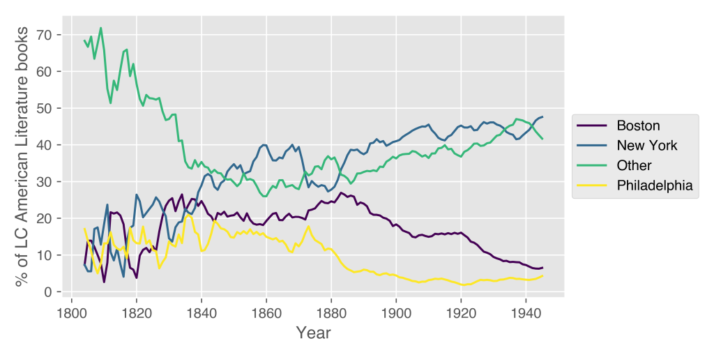

## Evidence from 11 million Library of Congress records

_This essay is currently under review._

Literary historians of the United States broadly agree that, at some point during the nineteenth century, New York City overtakes Boston as the literary capital of the US. What Pascale Casanova argues Paris is for world literature, New York becomes for US literature.

Data recently released by the Library of Congress allows us to assess this historical claim in new ways, but not in the format in which it was originally released. By converting this data to a form useful for computational literary studies, I have evaluated this geographic shift, and made it possible for other scholars of nineteenth century US literatures to use the same data for a wide range of purposes. With respect to imprint geographies, the data does not show what most literary histories would lead us to expect.

<figure>

<figcaption>

A line graph showing the five year rolling average percentage of LC American literature ("PS") records by imprint geography from 1800-1945.

</figcaption>

</figure>
