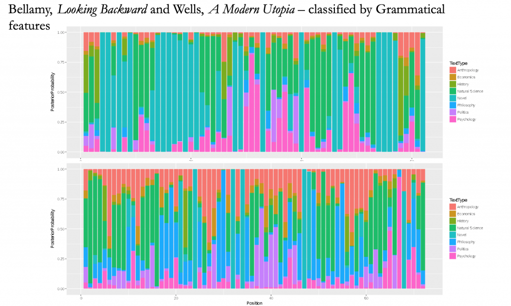

With Mark Algee-Hewitt, Michaela Bronstein, Abigail Droge, Ryan Heuser, Xander Manshel, Nichole Nomura, J.D. Porter, Hannah Walser

In this project, we explore the discursive inter-disciplinarity of novels, using machine learning to identify points at which authors incorporate the language and style of other contemporary disciplines into their narratives. How do authors signal the shift between narrative and, for example, history, philosophy or natural science? And do these signaling practices change with time or with discipline? Akin to what Bakhtin terms “heteroglossia,” these stylistic shifts indicate not only the historically contingent ways that novels are assembled from heterogeneous discourses, but they also shed light on the practices of disciplinary knowledge itself.

<figure>

<figcaption>

Primarily using parts-of-speech, we train a model to classify chunks of text according to various disciplinary formations. Utopian novels were among the most disciplinarily heterogeneous in our corpus.

</figcaption>

</figure>
