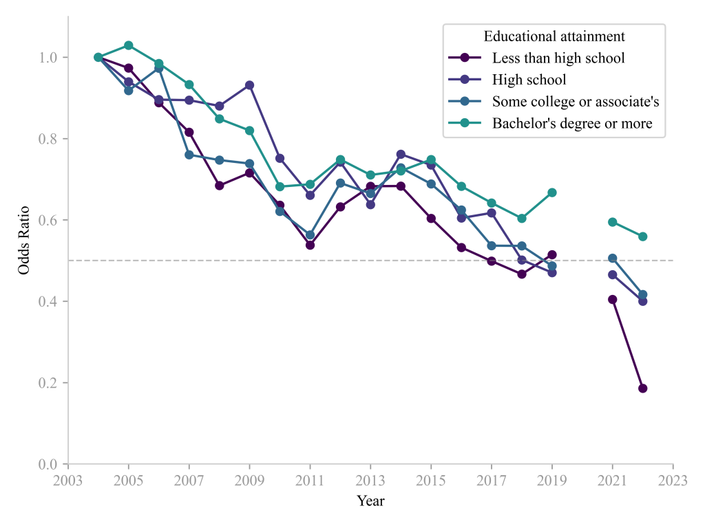

Below you will find the accessibility text and slides for my talk "The Ends of Reading" given at the University of Richmond [Faculty & Staff Research Symposium](https://as.richmond.edu/events/faculty-staff-symposium/index.html) on September 27, 2024.

- [Accessibility text](/files/ur_reading_talk.html)

- [Slides](/files/ur_reading.html)

<figure>

<figcaption>

Odds ratios of reading for personal interest yesterday relative to peak year (2004) by educational attainment. Data from the American Time Use Survey.

</figcaption>

</figure>
