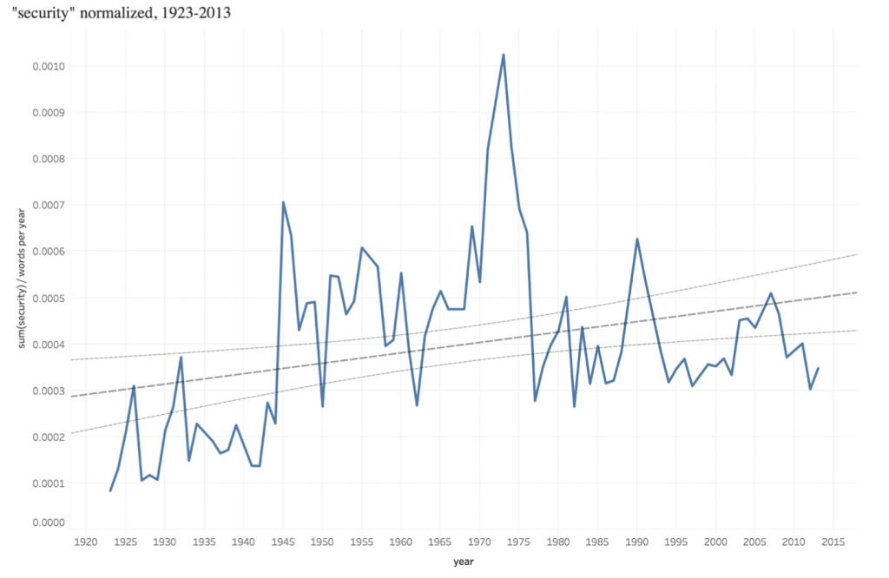
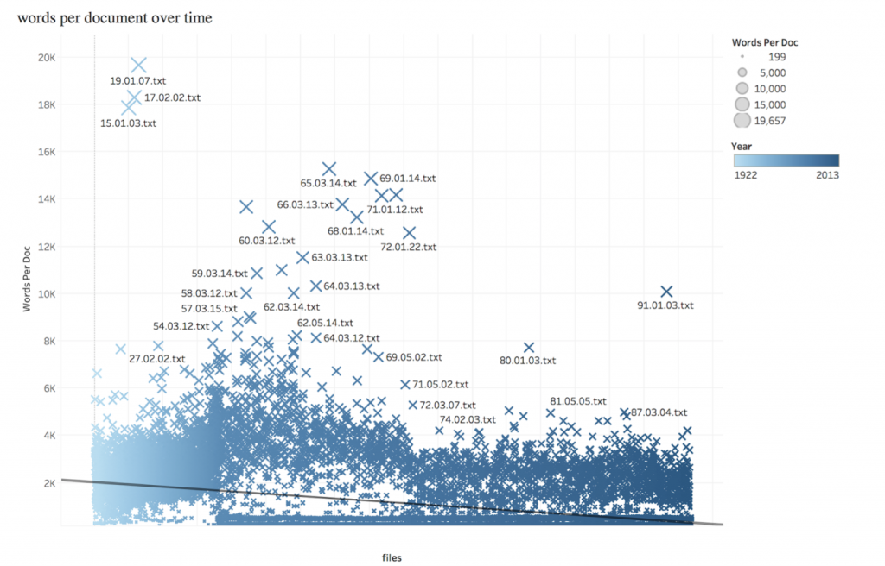

With Mark Algee-Hewitt, Whitney McIntosh, Stephen Stedman

Academic, political, and social concepts of “security” underwent rapid transformations after the Treaty of Versailles, proliferating in meaning as they offered new platforms for governmental action. This project tracks the changing set of associations around ‘security’ that anticipate the significance of the concept during the Cold War and after. To study this, we look at Foreign Affairs from the start of its publication (1922) to the eve of World War II, measuring the context of the word across its use. Crucially, Foreign Affairs prints not only academics, but also politicians, policymakers, members of the military, and others from across the field of International Relations, giving us access to an intersection between theory and practice.

<figure>

<figcaption>

This shows the frequency of the term "security" over time in a corpus containing all of the articles in _Foreign Affairs_, an American magazine about international relations. The _Foreign Affairs_ corpus was created for this project.

</figcaption>

</figure>

<figure>

<figcaption>

This shows the number of words per document in the _Foreign Affairs_ corpus over time. This shows the general trend in the magazine away from publishing a small number of long articles toward a greater number of shorter pieces.

</figcaption>

</figure>
