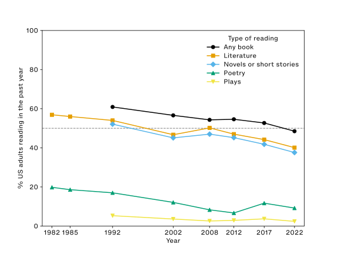
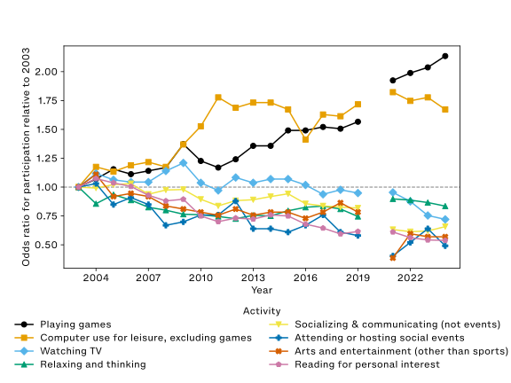
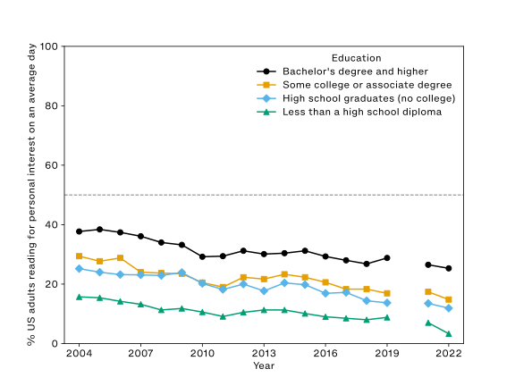
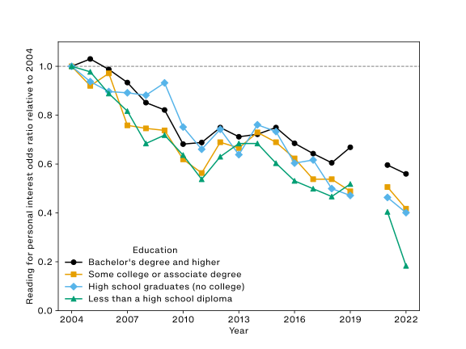
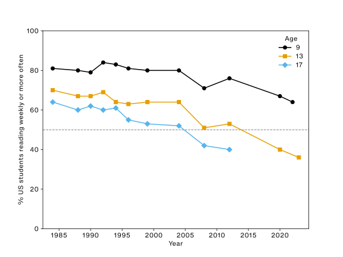

## Accepted Article Manuscript

Below is the accepted article manuscript for "The Ends of Reading," which is forthcoming with invited responses in [*American Literature*](https://read.dukeupress.edu/american-literature).

Once the article is available, I will link to the published version here.

## Abstract

People in the US today are much less likely to read voluntarily than they were a few decades ago. This essay explains findings from three federal government surveys that describe voluntary reading, and attempts to make them useful for literary studies. I argue that literary scholars need to know the rate and magnitude of the decline in voluntary reading for two reasons. First, the annual decline has been relatively constant over the past forty years. Arguments that reading has long been in crisis correctly identify this consistency while ignoring the cumulative effects of persistent decline. The recent history of voluntary reading in the US is best understood through data precisely because of the numbing effects of crisis rhetoric. Second, literary studies' specialized reading practices are only legibly specialized in contradistinction to non-specialized reading practices. As fewer people read voluntarily, this reduces the distinctiveness of literary studies' methods. Increasingly, the distinction is not between specialized and nonspecialized reading, but between reading and not reading. Literary studies has not registered widespread interest in nonspecialized reading, a byproduct, perhaps, of an overriding interest in specialized reading. Yet the latter depends to an extent largely unacknowledged within the profession on the former.

## Introduction

Allow me to begin by citing a few statistics about reading in the United States derived from the most recent federal government data:

- 52% of US adults have not read any book in the preceding year.
- 84% of US adults do not read anything for personal interest on an average day, including the news.
- The odds of US adults reading anything for personal interest on an average day are 46% lower than they were in 2003.
- The odds of US adults reading a novel, short story, poem, or play in the previous year are 49% lower than they were in 1982.
- The odds of US thirteen-year-olds reading for fun weekly or more often are 76% lower than they were in 1984.^[Data and code to reproduce the values and figures here and throughout this essay are available in this repository: @erikfrednerErikfrednerEndsofreading0202026.]

I hope to persuade literature scholars in the US and beyond to care about these statistics regarding voluntary reading because they matter for literary studies. Even though many literary scholars are indifferent to or mistrustful of statistics, some numbers like enrollments, majors, and academic jobs already are meaningful to the profession. It is my contention that these statistics about reading ought to join that list. Broadly, these data sets show that voluntary reading in the US has been in consistent decline for at least forty years. None of these trends has plateaued, either. Subsequent surveys will likely find further decreases. I argue that this decline should register for literary studies because the discipline depends on the prevalence of voluntary reading to an extent largely unacknowledged within the profession.

Readers unpersuaded by this argument will nevertheless benefit from the sections of this essay written to inform literary scholars of what these surveys measure, and how their results have changed over time. The implications of their findings are far-reaching, and I do not claim that my interpretation is their sole significance for US literary studies. Whatever specific goals individual scholars hope to advance through the reading of literature, the decline of reading and readers adversely affects all such efforts.

Literary scholars are understandably weary and wary of crisis rhetoric, just as they are weary and wary of the use of data to justify it. Yet the recent history of voluntary reading in the US is best understood through data *because* of the numbing effects of crisis rhetoric, which may even have obscured the severity of the problem. The data shows the decline in voluntary reading is not new. Counterintuitively, the rate of decline in voluntary reading may be no steeper today than it was before the introduction of some of reading's newest enemies like the smartphone.^[Some contest this view. See e.g., @twengeTrendsAdolescentsMedia2019.] Nevertheless, literary studies should pay attention now because, like debt, the decline of voluntary reading is a problem that compounds. To say that reading was in "crisis" in the 1980s and is still in "crisis" in the 2020s obscures the fact of a decline in the odds of voluntary reading by about half or more in the intervening years. Quantification helps when we wish to determine whether a difference in degree constitutes a difference in kind.

There are a few obvious reasons literary scholars should care about data showing a persistent decline in voluntary reading in the US. Perhaps the most obvious is that a decline in voluntary readers almost certainly impacts the number of "butts in seats" in literature classes. Contemporary university bureaucracies use that metric for relatively benign reasons like classroom assignments as well as malignant reasons like the euphemistic "administrative review," such as the one that recently gutted West Virginia University [@footeAlmostHeavenWest2025]. Many good reasons have already been given as to why the era of the neoliberal university has been hostile to the humanities in general, and to literary studies in particular.^[See e.g., @williamsPostWelfareStateUniversity2006, @dileoCorporateHumanitiesHigher2013, @shumwayUniversityNeoliberalismHumanities2017, and @hinesOutsideLiteraryStudies2022.] Yet the decline in the prevalence of voluntary reading is a part of this history that has rarely been acknowledged.

Another reason this decline should matter to literary scholars is that it is hard to imagine a scholar of literature sincerely making the case for less reading or fewer readers. Literary scholars give an *omnium gatherum* of reasons that reading in general and the reading of literature in particular makes a difference for themselves, their students, and the public. Whatever reasons individuals may give, all depend upon the choice to read, which a diminishing number of people in the US are making. Irrespective of how threatened or healthy the culture of reading may seem at a given university, scholars in the discipline ought to know how rare the choice to read has become nationally, how much rarer it is likely to become, and accordingly contemplate possible responses to these circumstances, which affect literary study within and beyond the university. These data sets address these questions in ways other methods cannot.

The distribution of resources and literary scholars' disciplinary view of reading as a good in itself are obvious reasons for literature professors to care about this data. But the decline in voluntary reading also matters to literary studies for non-obvious reasons I will discuss at greater length. Most importantly, voluntary reading is an unacknowledged prerequisite for literary studies. Among many other things, literary studies creates knowledge through its specialized ways of reading. Such techniques are only legibly specialized against a background of nonspecialized reading, which has been implicitly defined as voluntary reading, including but not limited to reading for pleasure. In a time when most people apparently do not read voluntarily, the specialized reading practices of literary studies become increasingly difficult for most to recognize as such because they have few or no recent experiences of other ways of reading. The difference is not between close reading and casual reading, but increasingly between reading and not reading.

US literary studies needs to recognize the decline in voluntary reading for reasons that are both self-interested and altruistic: Self-interested because changes in voluntary reading affect the position of literary studies, and altruistic because voluntary reading improves the lives of readers. If any part of this argument seems obvious, it is just as obvious that the field has not reckoned with its implications.

To achieve its aims, this essay pursues four tasks. First, I anticipate common arguments against a decline in voluntary reading. Second, I review three federal government surveys in order to explain where each of the statistics with which I began the essay came from, and show their trends by aggregating data from decades of government reports, including data not publicized. Since discussions of survey methodology will likely feel out of place in the pages of *American Literature*, I have taken pains in this section to extract only information of value to literary studies. The primary goal of my research into government arcana has been to make this data legible to and useful for literary scholars since, as I have noted, crisis rhetoric may obscure the compounding effects of the decline in voluntary reading. Third, I connect these statistics about voluntary reading to recent debates within literary studies. Specifically, the figure of the lay reader has been, by turns, lionized and vilified in recent scholarship. As voluntary reading dwindles, lay reading and professional reading will tend to converge, as the US moves from what Wendy Griswold terms a reading culture to a reading class. Finally, I explain how literary scholars can use these statistics to our advantage by emphasizing the increasing rarity of the competencies we teach, such as extensive reading. As a tactical matter, literary scholars should incentivize voluntary reading in their classes.

Each of the three surveys I discuss describes a consistent decline in the prevalence of voluntary reading in the US since the federal government began measuring it in the 1980s. Those who are skeptical of a major change between the recent past and the present are thus partially correct: What we observe in voluntary reading today is a continuation of a longstanding trend of decline, not a sudden change in magnitude or direction. But skeptics' partial vindication does not justify complacency because persistent declines compound. Bad numbers can get worse.

## Arguments against a decline in reading

Recent essays in periodicals have discussed the extent to which Americans no longer read as much or as well as they once did.^[See e.g., @jagtMyStudentsCant2026, @kirschReadingVice2026, @goldsteinKidsRarelyRead2025, @abramsWhatAreThey2025, @burnettWillHumanitiesSurvive2025, @mcmurtrieReadingStruggleMeets2025a, @cooperCanWeTurn2025, @kotskoLossThingsTook2024, @malesicTheresVeryGood2024, @horowitchEliteCollegeStudents2024, @damesThisEndLiterary2023, and @hellerEndEnglishMajor2023.] Many literary scholars have expressed doubt about these claims on social media, often by appealing to evidence from their classrooms. Whatever the conditions of individual classrooms may be, I hope to persuade skeptics that the decline in voluntary reading is real at the national level. Before getting to the data, I want to address four concrete objections often made to the argument that there has been a decline in voluntary reading.

The first is the assertion that declines in reading are better understood not as objective phenomena, but as a periodically recurring discourse that reflects elite anxieties. For example, Van Wyck Brooks wrote, "...with every year, for all the 'close' reading they \[critics\] recommend, there appears to be in colleges less general reading" [-@brooksWriterAmerica1953 21]. A generation later, the literacy scholar Martha Maxwell wrote, "...every generation, at some point, discovers that students cannot read as well as they would like or as well as professors expect" [-@maxwellImprovingStudentLearning1979 269]. I do not dispute the truthfulness of such claims. In fact, they make my point for me: Students have always flouted professors' expectations. But over time, absolute declines in voluntary reading create successively lower expectations of voluntary reading. What was once a new low soon becomes a new normal. Accordingly, declines compound without attracting much attention. Those who raise this objection usually assume that reading stays about the same, and all that changes is elite perception. The data suggest that, over the last forty years in the US, this assumption is mistaken.

The second objection: Literary historians rightly point out that moral panics about "bad" reading of various kinds are as old as reading itself. Scholars have often argued that such panics are best understood as responses by the powerful to the threat that those they oppress will acquire the means to contest their oppression through reading.^[See e.g., @altickEnglishCommonReader1957, @flintWomanReader183719141993, @brantlingerReadingLessonThreat1998, @pearsonWomensReadingBritain1999a, @mchenryForgottenReadersRecovering2002,  @sanchez-epplerDependentStatesChilds2005, and @emreParaliteraryMakingBad2017.] This counterargument implies that raising concerns about "bad" reading advances the interests of the powerful against the oppressed and is allied with the political right. Although the right has made use of government data about reading in ways I will discuss, that does not mean any use of this data must be reactionary.

The third counterargument: Perceived declines in reading ability are not absolute declines, but relative declines that actually index changing standards of literacy.^[See e.g.,@graffLiteracyMythLiteracy1979, @kaestleLiteracyUnitedStates1991, and @mcquillanLiteracyCrisisFalse1998.] For example, some literature scholars report questioning the assumption "that students can read the novels and poetry assigned for their courses" [@carlsonTheyDontRead2024, 1]. I do not address here the extent to which US readers' ability to comprehend what they read has changed because the surveys I study do not measure that. That said, standardized testing of twelfth grade students in the US suggests that student reading performance has decreased for all but the top 10% of students since 1992 [@NAEPReadingGrade]. The strongest such argument about changes in literacy today may be the different competencies digital reading and analog reading cultivate.^[See @baronWordsOnscreenFate2015, @jenkinsParticipatoryCultureNetworked2016, @wolfReaderComeHome2018, and @noordaGenMillennialsContrasts2024.] Those differences are a consequence not only of the technologies involved, but also of their business models, especially the sale of attention as a commodity.^[See @haylesHowWeThink2012, @birkertsChangingSubjectArt2015, @cittonEcologyAttention2017, @bennettContemporaryFictionsAttention2018a,
@baronHowWeRead2021, @smithThoreauAxeDistraction2023, and @guilloryCloseReading2024.] Although this objection about the changing meaning of literacy is valid for discussions of reading ability and comprehension, it is not as relevant for the proliferation of voluntary reading, which is my concern. Though it is not impossible that declines in comprehension explain declines in voluntary reading, I cannot adjudicate that claim with the available data.

Finally, literary scholars have and will object to surveys about reading because of their methodologies, especially the difficulties inherent in saying what is meant by "reading," and what distinguishes "voluntary reading" from other kinds of reading. Because each of the three surveys approaches this question slightly differently, I address the specifics of surveys' methodologies and results individually. Although individual differences among these surveys matter, for all three surveys respondents determine what counts as reading for them. For example, if a respondent were to report they read "a novel," no one would push back against their characterization to confirm they meant, say, literary fiction instead of young adult fiction, fan fiction, or a LitRPG before it would be counted. The only relevant question would be whether they read because they were required to for work or school, or because they chose to in their free time. At present, the surveys do not distinguish between analog and digital reading. These design choices leave room for a capacious understanding of reading and give agency to readers. Although Matthew Kirschenbaum produced one such methodological criticism of one of these surveys, he nevertheless concluded, "The data are significant to anyone who cares about reading and its place in a 21st-century society, and deserve to be treated seriously" [-@kirschenbaumHowReadingBeing2007]. That the data have not yet been treated seriously by literary studies is my present concern.

## The surveys

All three of the federal government surveys I will analyze describe reading done as an end in itself. I use the term "voluntary reading," though some other researchers have used the term "reading for pleasure" to characterize what these surveys measure.^[See e.g., @boneDeclineReadingPleasure2025a.] Although "reading for pleasure" has more conceptual currency in literary studies than "voluntary reading"---above all in its association with Roland Barthes [-@barthesPleasureText1975]---I prefer "voluntary reading" here because it avoids the problem of whether certain types of reading included in some surveys are done in pursuit of (or can provide) pleasure. For example, it is unclear if or when reading *The New York Times* is reading for pleasure, though reading the *Times* could count as voluntary reading in several of the studies. "Voluntary reading" is not the phrase used by any of these three surveys. Each uses a different term, including reading books generally, reading specific forms like poetry, reading for personal interest, and reading for fun. Across these three surveys, what I term voluntary reading is reading that is not done for work, volunteering, school, or religious practice.

Voluntary reading includes, but is not limited to, the nonprofessional reading of literature. Readers will recognize the difficulty in delineating the boundary between literary scholars' professional and nonprofessional reading. If a scholar of nineteenth-century US poetry reads eighth-century Chinese poetry in the evening, how can we be certain such reading is "voluntary" if it might influence their research? In practice, the surveys defer to the judgments of individual respondents on such matters. While the boundaries between literary scholars' professional and nonprofessional reading may be especially ambiguous, that ambiguity does not hold for most people responding to these surveys.

I discuss the surveys in the following order. The US Census Bureau has fielded the Survey of Public Participation in the Arts (SPPA) and the American Time Use Survey (ATUS) for the National Endowment for the Arts (NEA) and the Bureau of Labor Statistics (BLS) since 1982 and 2003, respectively. The SPPA is periodic and the ATUS is annual. The National Center for Education Statistics (NCES) periodically fields the National Assessment of Educational Progress (NAEP) Long-Term Trends (LTT) survey, which collects data about voluntary reading among students at particular ages (9, 13, and 17). The SPPA, ATUS, and LTT all show that the proportion of the US population who read voluntarily has contracted over recent decades, and that declines are observable in all surveyed subgroups.

### Reading in the last year

Some literary scholars are already familiar with The National Endowment for the Arts' (NEA) research reports discussing the Survey of Public Participation in the Arts (SPPA), especially *Reading at Risk*. If you had to summarize the trend in the NEA's reports on the SPPA with respect to reading in one word, you could do worse than "decline." But "decline" does not tell the whole story. Nor does it match the narrative of the NEA's reports.

A chronological reading of the reports instead shows a pattern of panic about reading followed by relief. *Who Reads Literature?* framed its results in response to right-wing arguments that US culture was becoming aliterate---able to read but disinclined to do so.^[See @bennettReclaimLegacyReport1984a, @thimmeschAliteracyPeopleWho1984, and @bloomClosingAmericanMind1987.] However, the report did so in order to point out that some prior surveys had shown growth in reading between 1955 and 1984 [@zillWhoReadsLiterature1990, 18]. At first, the data suggested an overreaction from the right.

Relief is followed by panic: *Reading at Risk* described its findings as presaging "an imminent cultural crisis" [-@ReadingRiskSurvey2004a, xiii]. Inflaming a culture war he had helped start, Mark Bauerlein, who directed the NEA's Office of Research and Analysis during the writing of *Reading at Risk*, wielded it as a weapon in *The Dumbest Generation* [-@bauerleinDumbestGenerationHow2008, 39-71]. When, in an interview about that book, Bauerlein was asked who is to blame for the stupefaction of young Americans, he responded, "I blame my colleagues, the humanities professors" because they taught young people an "irreverence toward historical knowledge and literary understanding" [@bauerleinYoungAmericansAre2008 4:57--5:26]. Yet shifting blame onto humanities professors makes little sense when the statistics in Bauerlein's own report show the sharpest declines in reading occurring among those who have never studied at the college level.

Panic is followed by relief: *Reading on the Rise* showed a turnaround the poet Dana Gioia, then-Chairman of the NEA, warned might seem "too good to be true" [-@ReadingRiseNew2009, 1]. It highlights a reversal among young adult readers (age 18-24), who read literature at a significantly higher rate in 2008 than in 2002.^[Though we cannot know its exact prevalence among respondents' reading, the final installment of the *Harry Potter* series was published in the US within twelve months of the 2008 surveys.] Subsequent SPPAs suggested that Gioia was right to worry. Reading soon reverted to the prevailing downward trend.

More recent NEA reports on the SPPA have drawn less controversy, a lull in the panic-relief pattern. Unfortunately, the lack of controversy has corresponded to a lack of attention.^[For instance, Leah Price compared the NEA's reports to countervailing trends in book purchases, which, unlike voluntary reading, have been increasing [-@priceWhatWeTalk2019, 2-3]. Price cites *Reading at Risk* and *To Read or Not to Read*, but omits the reports based on the SPPAs from 2008, 2012, and 2017 even though they all would have been more current.]

While it is true the better-known SPPA reports have been framed by right-wing arguments and authors, the NEA reports are *not* the SPPA data. It is possible to use the data without accepting either the reports' calculations or conclusions. If any of these histories has made scholars skeptical of the SPPA reports, I would counter that a justified suspicion about the authors and motives of certain reports may have tended toward an unjustified suspicion of the underlying data.

In order to study the impact of public participation in the arts on various public goods, the NEA needs to measure arts participation in ways that are comparable over time [@Research2023]. This mandate creates two distinct incentives: Researchers need to keep the questions as consistent as possible from one survey to the next, while they simultaneously respond to cultural and technological changes that impact how arts participation should be measured. For example, surveyors had to specify that reading done via the internet or ereaders counts after these new technologies became widespread.

The US Census Bureau administers the SPPA for the NEA.^[They do so as a supplement to the Current Population Survey (CPS), which measures labor force participation rates. CPS "is a monthly sample survey of 60,000 eligible households...conducted using a combination of live telephone and in-person interviews" [@LaborForceStatistics2020]. CPS interviews US people age 16 or older who are neither in the military nor institutionalized [@Methodology2021].] The SPPA asks the following key questions about voluntary reading:

1. With the exception of books required for work or school, did you read any books during the last 12 months? Include print books or electronic books.
1. About how many books did you read [during the last 12 months]?
1. During the last 12 months, did you read any...

Read if needed: Include any reading of novels or short stories, poetry, or plays in the last 12 months, regardless of whether it was in books, magazines, or newspapers, in paper form or online.

a. ...Novels or short stories?
b. ...Poetry?
c. ...Plays?^[I omit valid repsonses, codes, and subsequent questions about reading here. See the full questionniare for details: @nationalendowmentfortheartsSurveyPublicParticipation2024, 9--10.]

For the SPPA, "reading" is not restricted to the codex. Some scholars reject "the idea that there is a 'normal' way of reading," which survey questions might seem to reify [@ruberyReaderBlockHistory2022, 22]. Yet survey participants themselves determine what and how they read. If it would be ludicrous to claim these questions are sufficient to a fulsome understanding of the public's reading, it would be just as ludicrous to dismiss them.

The SPPA's questions about literary reading have been conceptually consistent since the first survey of 1982, though the way the questions are asked has changed. Notably, respondents have never been asked if they read "literature." Rather, someone is reported as reading literature if they have read any novels, short stories, poetry, or plays in the preceding year.^[In 1982 and 1985, respondents were asked whether they had read any novels, short stories, poetry, or plays as a single question. Subsequent surveys count those forms individually. Thus, the "literature" definition has been consistent since 1982, although its component parts have since been broken out into multiple questions.]

It should be noted here that such survey questions are subject to social desirability bias, which means survey respondents are more likely to answer questions in ways they believe will reflect well on them. For example, more people report voting in elections than actually vote [@holbrookSocialDesirabilityBias2010]. Even as reading for pleasure has been declining, reading remains socially desirable. So, while the SPPA measures reading books and literature, it also measures how socially desirable it is to be perceived as a person who read a book last year. Although we cannot disentangle them, as the number of people reading for pleasure has been declining, so too has the number of people lying about reading.

{#fig:sppa .marginfig}

The values in @fig:sppa clearly slip over time.^[My thanks to Sunil Iyengar and the research staff of the National Endowment for the Arts for help finding some values.] However, it can be hard to see how large these changes are in percentages alone. Comparing changes in the odds of reading helps by controlling for absolute differences in participation.^[Previous studies have used odds ratios to assess changing participation rates in the SPPA relative to a reference year. I use the same method as in the following paper, but applied to different set of questions: @dimaggioArtsParticipationCultural2004, 176-177.] That may sound technical, but it makes intuitive sense: In @fig:sppa, a 1% decrease among poetry readers is more meaningful than a 1% decrease among novel readers since a much smaller share of the public reads poetry than novels or short stories. The odds of reading novels or short stories are 45% lower than they were in 1992, whereas the odds of reading poetry or plays are down by 51% and 56%, respectively. The odds of reading literature in the preceding year are about 49% lower than they were in 1982.

Based on the SPPA alone, it remains unclear whether the rate of decline for reading literature has been increasing over time. Some drops in @fig:sppa are jagged because of changes in survey methodology.^[For example, the first two SPPAs asked respondents if they had read *or listened* to poetry, whereas subsequent surveys only asked whether they had read poetry.] Others are because the SPPA has been taken at uneven intervals. One value of the American Time Use Survey, to which we now turn, is that it has more precise information about the extent of voluntary reading, is gathered annually, and asks participants to reflect on things they did yesterday rather than what they recall from the past year.

### Reading yesterday

As it does with the SPPA, the US Census Bureau also fields the American Time Use Survey (ATUS) for the Bureau of Labor Statistics (BLS). The main purpose of the ATUS is to describe how Americans spend their time when they are not working. The ATUS has been taken annually since 2003, with the exception of 2020 due to the pandemic [@ImpactCoronavirusCOVID192022].

The ATUS's statistics about reading for pleasure differ from the SPPA's in two key ways. An advantageous difference is that ATUS is more precise: It records how many minutes respondents read yesterday, not whether they recalled what they read in the preceding year. The disadvantageous difference is that, unlike the SPPA, the ATUS does not separate voluntary reading by literary form. The SPPA draws no distinction between reading poetry and reading Wikipedia so long as any such reading is done for personal interest rather than for work or school.

Like the SPPA, the ATUS is also conducted on a representative sample from the Current Population Survey. Respondents report how they used their time over the preceding day in intervals as short as one minute [@AmericanTimeUse2018]. In order to provide such granular detail, respondents are instructed to keep a time use diary in advance of their interview. Interviewers then aggregate specific activities reported by respondents to general categories based on preestablished rules. For example, if a respondent says, "I read the news from 8:00 to 8:15" during their interview, the reason that person was reading would be taken into account when categorizing their time use. An investment banker reading the business press might be categorized as reading for work if doing so is part of their job whereas an accountant reading a music review would likely be reading for what the ATUS terms "personal interest."

Like the voluntary reading in the SPPA, the ATUS's "reading for personal interest" is reading not done for work, other income-generating activity, volunteering, education, religious education, or the reading of scripture, all of which would be categorized separately. The code book lists these examples:

> reading a magazine/book/newspaper (personal interest); checking out library books; flipping/leafing through magazine (personal interest); being read to (personal interest); listening to books on tape/audio books (personal interest); reading, unspecified; borrowing books from the library; doing research (personal interest); returning library books/browsing at the library; reading a book on a Kindle or other electronic book reader (personal interest) [@AmericanTimeUse2024a, 48]

In his guide to *The Harvard Classics*, Charles Eliot said if someone could "spare but fifteen minutes a day for reading," they could give themselves a liberal education [-@eliotEditorIntroductionReader1910, 8]. As of 2024, seventeen minutes a day is about the average amount of time Americans spent reading anything for personal interest on an average day.^[My thanks to Jeremy Oreper at the Bureau of Labor Statistics for help with this data.] However, this average conceals the fact that 84% of people in the US read for zero minutes on an average day. On average, those who read for personal interest did so for 104 minutes. In the peak year of 2004, 28% of the US population read for personal interest on an average day; in 2024, 16% did. In 2024, the odds of Americans reading for personal interest were 46% lower than they were in 2003.

Readers may be wondering to what extent this decline is explained by frequently cited competitors of reading for leisure time like television, video games, and the internet. @fig:atusor shows the odds ratios for participating in many leisure activities viewed as competition to reading. Relative to 2003, respondents were less likely to spend time on reading, socializing, the arts, and television, and more likely to spend time on games and computing. However, the changes in @fig:atusor only correlate. The data cannot tell us whether individual respondents "traded" their reading time for other activities since the ATUS does not interview the same people from one year to the next.

{#fig:atusor .marginfig}

Some readers might wonder if these trends are explained by even larger forces, such as a reduction in leisure time as economic precarity and inequality have increased. While new technologies are usually the prime suspects in the reading murder mystery, some critics have instead looked to macroeconomic transformations after the 2008 financial crisis for an explanation.^[See @brouilletteRiseFallEnglishLanguage2022 125-126.] Surprisingly, people in the US reported about 1% more leisure time in 2024 than in 2003. Regardless of how most people spent this small amount of additional leisure time, the survey suggests they mostly did not spend it reading.

While all of the values presented in this essay thus far are weighted to represent the US population as a whole, they can also be decomposed into demographic groups. Although researchers observe differences in voluntary reading by race, ethnicity, gender, income, and their intersections, education is consistently the strongest predictor of reading.

@fig:atused shows three noteworthy patterns in reading for personal interest by education.^[My thanks to Michelle Freeman at the Bureau of Labor Statistics for sharing these estimates, which BLS does not publicize.] First, even as reading declines, more education predicts more reading. Yet none of these groups, including the most educated, has ever been more likely than not to read for personal interest on any given day. @fig:atusedor shows the most important fact: Even though more education predicts more reading, the odds of reading have been decreasing at relatively similar rates across education levels.

{#fig:atused .marginfig}

{#fig:atusedor .marginfig}

As voluntary reading decreases, reading rates among those with more education come to resemble the reading rates of those with less education from years prior. The decline in voluntary reading has been difficult to notice because the rate of decline has been relatively consistent over time and therefore has not reached a point of sudden crisis. This pattern of voluntary reading by education demonstrates why the cumulative effects of consistent decline make a difference: the general downward trend encompasses everyone, including those most likely to read.

### Children reading for fun

Whereas the previous two surveys focus on adults, the National Assessment of Educational Progress's (NAEP) Long-Term Trends (LTT) survey focuses on children. Readers may already be familiar with the Nation's Report Card, which has evaluated student ability in reading and math since 1971 [@NationalAssessmentEducational2025]. Fewer know about the LTT. I focus specifically on the LTT's survey of student experiences, which asks students about several topics that impact their learning, such as absenteeism [@WhatAreMain2024].

Beginning in 1984, the LTT asks children how often they "read for fun on \[their\] own time" [@LongTermTrendReading, 3]. This question matches the restrictions of the previous surveys in that the reading cannot be done for school or work. Students may respond they read for fun "almost every day," "once or twice a week," "once or twice a month," "a few times a year," or "never or hardly ever."

{#fig:ltt .marginfig}

As @fig:ltt shows, most children reported reading for fun at least weekly until the 2000s. This is no longer the case for thirteen- and seventeen-year-olds. While nine-year-olds have always read for fun more than older children, that gap has been growing over time. Like educational attainment and reading for personal intereset, children's ages also predict how often they read for fun. The older children get, the less likely they are to read for fun regularly. Today, the odds of nine-year-olds reading for fun weekly or more are 58% lower than they were in 1984. But the odds of thirteen-year-olds reading for fun weekly or more are 76% lower.^[The odds of seventeen-year-olds reading are 62% lower. However, the LTT survey has not been repeated for seventeen-year-olds since 2012, so this value is not as comparable with the data for nine- or thirteen-year-olds since it is much older.]

### Predictions

None of the preceding survey data tells us whether there is a floor for voluntary reading in the US or what it is. None of these trends has plateaued. Most of these trends are highly linear, suggesting further decline in subsequent surveys is likely. I will venture a prediction with the ATUS, which is likely the most accurate of these surveys since it asks respondents about things they did yesterday that they were instructed to write down, and is taken annually. If the federal government is still administering the ATUS, a simple linear model predicts that fewer than 1 in 10 Americans will read for personal interest on an average day for the first time in 2034.

The sociologist of reading Wendy Griswold views such trends not as a deleterious effect of new technologies---the position associated with critiques of television by Marshall McLuhan [-@mcluhanGutenbergGalaxyMaking1962] and Neil Postman [-@postmanAmusingOurselvesDeath1985], which have, *mutatis mutandis*, been extended to the internet---but as a return from a state of exception to the status quo ante. Griswold argues that "most people in advanced industrial and post-industrial countries are not and will not be readers" [-@griswoldRegionalismReadingClass2008, 36]. Instead, she distinguishes between what she terms a reading class and a reading culture. All societies with writing have reading classes, but few societies have ever had reading cultures. The reading class is a social formation defined by its professional and nonprofessional reading as well as its elite socioeconomic status. A reading culture, by contrast, "is a society where reading is expected, valued, and common" [-@griswoldRegionalismReadingClass2008, 37]. In these terms, the most panicky of the NEA reports lament the erosion of the US reading culture, which Griswold says peaked in the US from the mid-nineteenth to the mid-twentieth century. If there is any truth in Griswold's distinction, US literary studies---which professionalized during that reading culture---may need to reconceptualize itself not in relation to a reading culture but to a reading class.^[On the formation of US literary studies in the nineteenth and twentieth centuries, see @vanderbiltAmericanLiteratureAcademy1986, @shumwayCreatingAmericanCivilization1994, @renkerOriginsAmericanLiterature2007, and @glazenerLiteratureMakingHistory2016.]

One way of making that transition would be by shoring up the reading class. Elsewhere, Griswold has argued that "professional members of the reading class are evangelists, fighting at the front line of culture to convert people to reading" [-@griswoldEvangelistsCultureOne2015, 97]. Yet I have found little discussion within literary studies as to whether, to stick with Griswold's metaphor, the field evangelizes or preaches to the converted. This discussion has not happened in part because, without knowledge of the decline in voluntary reading, the profession cannot see how great the difference between the two has become.

## The lay reader

Literary studies has not often discussed arguments such as Griswold advances in part because the field seems to have underestimated or ignored the rate and magnitude of the erosion of voluntary reading. Consistent decline has obscured its compounding effects, yet crisis rhetoric rings hollow when the rate of change has not changed much.

Literary scholars' relative disinterest in nonprofessional reading is a byproduct of its overriding interest in professional reading [@auyoungWhatWeMean2020]. I advocate here for an inversion of this tendency for the sake of professional reading. The data suggest that the future of professional reading requires taking serious interest in the prevalence of nonprofessional, especially voluntary, reading. As I show below, the field has more often considered voluntary reading as an *other* of professional literary studies rather than a prerequisite, most often through the figure of the lay reader.^[For a thorough review of the lay reader, see @skiverenPostcritiqueProblemLay2022. For an account focused on the contemporary lay reader, see @murrayPickingYourProfessor2024.] However, the lay reader can be more useful as an interlocutor for literary studies if and only if the field recognizes how rare she has become. As she becomes rarer, lay reading and professional reading will tend to converge. Differences among readers within a reading class are less pronounced than differences among readers within a reading culture.

Interest in the lay reader is hardly new---recall Virginia Woolf's [-@woolfCommonReader1925] common reader---but her contemporary reputation differs considerably from its predecessors. In broad strokes, one can trace a series of changing attitudes among literary critics that begins early in the twentieth century with the view that the lay reader is either too uneducated to read well, or else has been miseducated by bad books. Later, voluntary reading seemed complicit in lay readers' oppression. Now, some argue that lay readers' attachments may have something to teach professional readers.

When he was conducting his reading experiments for *Practical Criticism*, I.A. Richards was trying to train his students out of their "stock responses" to familiar tropes and poetic meters [-@richardsPracticalCriticismStudy2004 14]. These responses had been cultivated through experience, education, and voluntary reading. Similarly, F.R. Leavis and Denys Thompson lamented that whatever aesthetic education begins in school ends out of school because of the market's "competing exploitation of the cheapest emotional responses; films, newspapers, publicity...offer satisfaction at the lowest level, and inculcate the choosing of the most immediate pleasure, got with the least effort" [-@leavisCultureEnvironment1933 3--5]. Harold Bloom made a comparatively recent contribution to this line of argument in a review of *Harry Potter*, where he asks: "Is it better that they read Rowling than not read at all?" [-@bloomCan35Million2000]. According to the headline, the answer is no. All of these comments tend towards the view I glossed above of the lay reader as either uneducated or miseducated by pleasurable dross.

Another line of argument views the lay reader as complicit. She fails to recognize what Lauren Berlant [-@berlantCruelOptimism2011a] might have called the cruel optimism of her voluntary reading, and so becomes complicit in her own oppression and the oppression of others. Max Horkheimer and Theodor Adorno interpret the culture industry, including but not limited to publishing, as "the prolongation of work...sought by those who want to escape the mechanized labor process so that they can cope with it again" [-@horkheimerDialecticEnlightenmentPhilosophical2002, 109]. Frantz Fanon recalls reading "white books" and thereby taking himself "into the prejudices, the myths, the folklore that have come to \[him\] from Europe" [-@fanonBlackSkinWhite2008a, 148]. For Kate Millett, sexual politics communicated through literature and culture contributes to the "'socialization' of both sexes to basic patriarchal polities" [-@millettSexualPolitics2016, 26]. These famous examples among many others show how lay reading came to seem complicit. Not reading might well seem preferable to reading that normalizes assent to oppression.

One early defender of lay reading against these lines of attack emerged in the sociology of literature. Reflecting on her research on romance readers, Janice Radway writes that it is easy to condemn "romance reading as a reactionary force that reconciles women to a social situation which denies them full development" while simultaneously failing to acknowledge "other benefits associated with the act of reading as a restorative pastime" [-@radwayWomenReadRomance1983 68]. Like others who later come to the defense of the lay reader, Radway acknowledges the possibility that her readers may fail suspicious readers' imperative to not get duped. At the same time, benefits like "reading as a restorative pastime" are of intrinsic value to their beneficiaries, and potentially of value to others, too. Eve Kosofsky Sedgwick's [-@sedgwickParanoidReadingReparative1997] reparative reading played a similar counterpoint to an undeceived paranoid reading. Heather Love recently summarized the most radical proposition of Sedgwick's position as follows: "that the pursuit of happiness might displace the search for truth in literary criticism," potentially allying the reparative reader's pursuit of happiness with voluntary reading [-@loveMerelyAmeliorativeReading2023 210].

A positive spin on the lay reader has lately appeared under the banners of surface reading and postcritique.^[See @bestSurfaceReadingIntroduction2009 as well as @ankerCritiquePostcritique2017.] The critic most strongly associated with lay reading today is Rita Felski, who has questioned how different the attachments formed through reading for pleasure and literary scholars' reading for work really are. Felski argues that the objects of the hermeneutics of suspicion "fly below the radar of lay readers as well as old-school scholars and aesthetes," thereby justifying the role of the critic [-@felskiLimitsCritique2015, 98]. While some see this preference for what the text includes as opposed to what it excludes as naive, Felski presents it as a consequence of readers' attention. She explains some mechanisms of that encounter by focusing on readerly experiences often invoked by students and dismissed by their professors, like identification with characters [-@felskiHookedArtAttachment2020, 124-135].^[A related concept is students' routine invocation of "relatability," ably described by @glaveyHavingCokeYou2019.] Without plumbing the depths of these arguments, suffice it to say Felski attempts to dismiss prior dismissals of voluntary reading.

Felski's work has provoked vigorous debate.^[See e.g., @robbinsCriticismPoliticsPolemical2022.] John Guillory engaged with Felski's argument by historicizing how lay reading and professional reading have coexisted. For Guillory, pleasure distinguishes them: Professional reading "stands back from the experience of pleasure in reading," whereas lay reading "is motivated primarily by the experience of *pleasure*" [-@guilloryProfessingCriticismEssays2022, 331-2, italics in original]. He observes that professional and nonprofessional reading are both threatened by the mutual incomprehensibility of their motives and so insists on their separation. While Guillory recognizes reading for pleasure specifically, and voluntary reading more generally, as necessary antecedents to professional reading, he fails to acknowledge how great a threat the decline of voluntary reading is to the profession he studies.

Professional readers have answered the questions of who the lay reader is and how she reads over the past century in ways that have ranged from patronizing to curious. Throughout, lay reading of literature appears as other and obstacle to professional reading. Yet, more practically, none of these works addresses the extent to which declines in voluntary reading change the character of lay reading by limiting the breadth of who reads and what they read. As marginal readers lose the habit of reading, lay reading and professional reading will tend to converge because those who continue to read are likely to be increasingly similar to one another. As Griswold argues, a reading class is different from a reading culture.

## How literary studies can use this data

Literary scholars who internalize this data about voluntary reading will gain three things: Knowledge of the recent history of voluntary reading in the US, a new way of thinking about the debate within literary studies surrounding lay reading, and a recognition that, for a large and growing majority of people in the US, reading of any sort is typically involuntary and rare. This population-level information is crucial for literary scholars to contemplate, especially since scholars' personal and professional networks likely overrepresent readers.

Although educational attainment remains the best predictor of reading, it is not known whether majoring in literary studies is associated with more voluntary reading than other majors. If one goal of literary studies is to improve and sustain reading, literary scholars should want to know if they are succeeding. If that position---Griswold's evangelism---seems at all objectionable, consider the opposite one: What literary scholar hopes her students, as a consequence of taking her courses, would read less?

Voluntary reading is thus an unacknowledged prerequisite for and hopeful aftereffect of literary studies. Yet the specialized reading techniques of the field can only be recognized as specialized against a background of other reading that an increasing majority of the population lacks. Literary studies has a vested but unacknowledged interest in voluntary reading.

At the same time, the persistent and cumulative decline of voluntary reading documented here also provides literary studies with a rhetorical opportunity. The field can use these statistics to its advantage by emphasizing the increasing rarity of the competencies it teaches---competencies large language models seem poised to make rarer over the short term.

Practically, there are several recurring recommendations in the research on voluntary reading literary scholars might consider implementing in their courses. One is giving students extra credit for reading books of their choosing, which encourages them to practice identifying texts they wish to read, and, if they are fortunate, experiences of reading for pleasure [@vogrinciccepicReadingPleasureReview2024, 63-64]. Readers also need to socialize about their reading, so instructors who offer extra credit for voluntary reading could offer additional credit for students who read a book together and meet to discuss it outside of class. These suggestions do not mean literary studies needs to redirect its pedagogical efforts towards literary appreciation.^[However, scholars like @cluneDefenseJudgment2021a have made arguments that tend in that direction.] Creating opportunities for students to read voluntarily and take pleasure in that reading may be an effective means to improve the reading the discipline values by providing experiences of reading that contrast with the specialized techniques developed and evaluated in class.

Although the literature suggests these options are viable, I wish to emphasize they are by no means adequate to the problem. The primary purpose of this essay is to acquaint literary scholars with data showing the recent history of voluntary reading in the US, and to show why it matters for literary studies. Whether and how the discipline will respond is a different question.