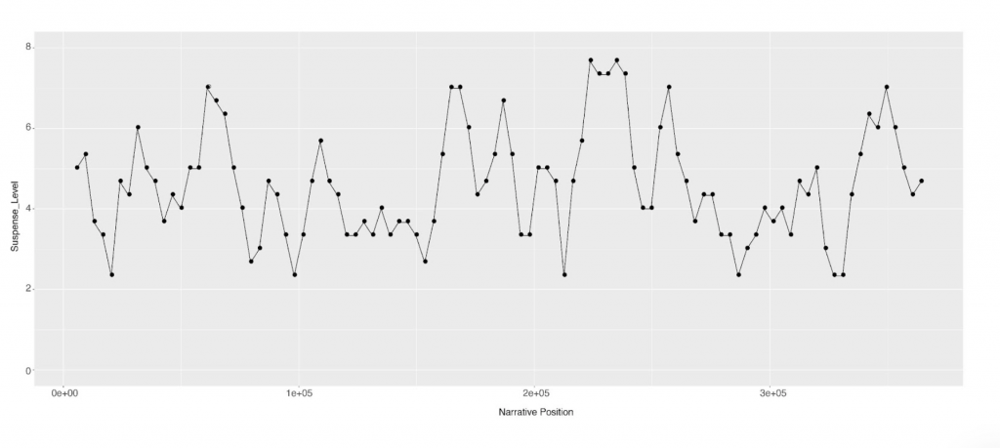

With Mark Algee-Hewitt, Chelsea Davis, Abigail Droge, Tasha Eccles, Morgan Frank, J. D. Porter, Andrew Shephard, Hannah Walser

This project seeks to bridge the gap between the experience of suspense as it is felt by the reader in anticipation of impending events, and the formal features that may be responsible for producing this feeling. Does suspense work in the same way in every period and genre, and for all types of readers – or is it a highly individual reaction, promoted by techniques that vary according to time and place? The diverse group of researchers involved in this project are exploring these central questions – which lie at the intersection of language, narrative and psychology – via a detailed comparative analysis of “suspenseful” texts from 1750 to the present day.

<figure>

<figcaption>

This graph represents our neural network's predicted ratings for the suspensefulness of each 1% slice of _Jane Eyre_. The model is trained on passages selected by the researchers, who rated the suspense they experienced in each passage.

</figcaption>

</figure>
