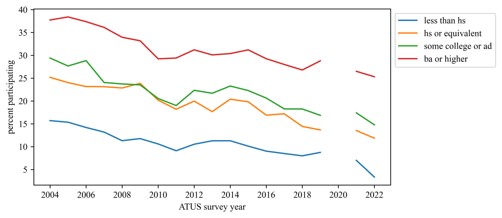

"The Ends of Reading: Reading statistics and the overestimation of literary studies' aim"

(10,000 words. Under review.)

## Abstract

Literary scholars are universally aware of two trends for which we have ample evidence both anecdotal and statistical: declining numbers of academic jobs and majors. However, we are mostly unaware of a third set of statistics that this essay argues need to be a part of every conversation in which we invoke the numbers of majors and jobs: Statistics about reading for pleasure.

Focusing solely on what literary scholars need to know, this essay reviews the history, methods, and findings from two representative national surveys of reading conducted by the US Census Bureau on behalf of two other federal agencies between 1982 and 2022: the Survey of Public Participation in the Arts and the American Time Use Survey. It compiles historical data about pleasure reading from both surveys in one place for the first time, incorporates data newly published in 2024, and uses that data to describe changes in US leisure reading over the past forty years with new analyses not presented in any government report. Both surveys reveal recent declines in the odds of reading for pleasure of more than 40%, and, within certain groups, by more than 80%. Ultimately, it considers how this data relates to the argument at the core of John Guillory's new book, which he terms the overestimation of literary criticism's aim.

When these statistics have received public attention, conservatives have usually played the role of Cassandra, prophesying the end of reading based on such statistics. This political alignment, I argue, has caused literary scholars to disregard good data about real changes in reading that has been used to support bad arguments. We have done so at our peril: Intuiting reading's general decline without a sense of its rate or magnitude has prevented us from asking the right questions about rapid changes in the core practice of our discipline. The essay concludes by suggesting one way that literary studies can and should respond to the data: Study whether the discipline causes its students to read more for pleasure than we would expect based on their educational attainment alone.

<figure>

<figcaption>

Percentage of Americans who reported reading _anything_ yesterday for "personal interest" for more than zero minutes by educational attainment. Data from the American Time Use Survey. (Gap in 2020 due to pandemic.)

</figcaption>

</figure>
