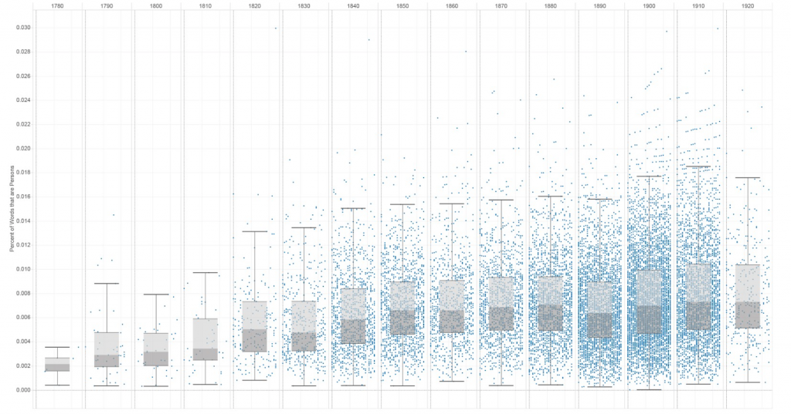
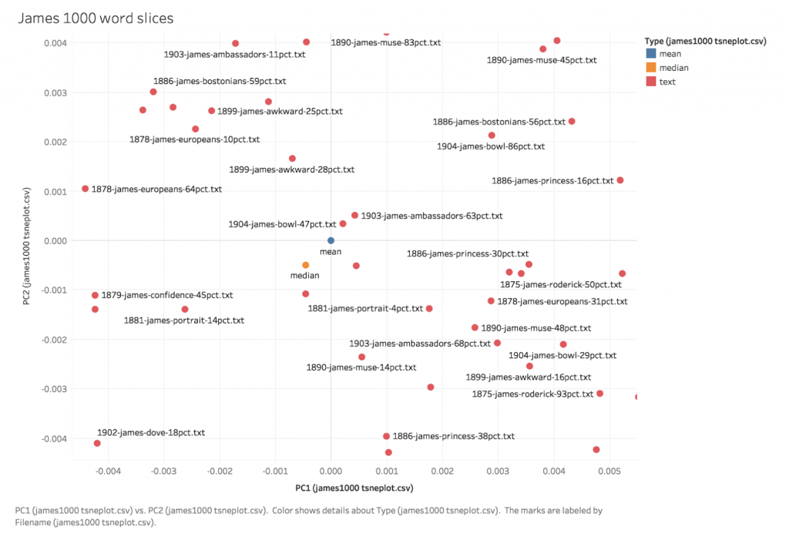

With Mark Algee-Hewitt

We gave this as a talk at DH 2020, [the text for which is here](https://litlab.stanford.edu/typicality-in-the-u-s-novel/).

Do literary critics need to know what the typical novel is like? Critics routinely turn to moments where novels violate our expectations of the form, expectations that have been developed by reading, writing about, and discussing novels of all sorts. We may intuitively reject the idea of any given novel’s typicality—each is, in some sense, unlike any other—yet paradoxically rely on a conception of the typical novel as a heuristic for other works in the genre. We know when our expectations in a novel have been undercut, but in writing about a given novel, we tend to focus more on what that undercutting does than the origins of the expectation. This project shifts the critical focus from the former to the latter.

<figure>

<figcaption>

How populous is the typical novel? This graph shows the distributions of the percentage of words in the Gale Corpus of American Fiction that are persons over time.

</figcaption>

</figure>

<figure>

<figcaption>

t-sne plot of slices of Henry James novels arranged by his typical distribution of nouns.

</figcaption>

</figure>
